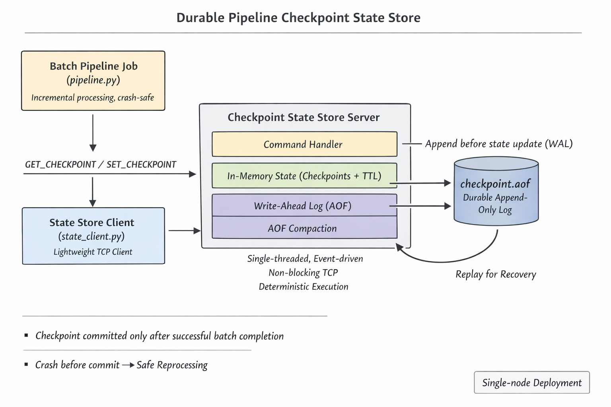

# Pipeline State Store (Checkpoint Service)

## Overview

This project implements a **durable, externalized checkpoint state service** for data pipelines, inspired by how real production systems (Airflow, Spark, Kafka consumers, Redis) manage **pipeline progress and recovery**.

The goal is **not** to reimplement Redis or Kafka, but to demonstrate **first‑principles systems design** for:

* Incremental data processing
* Crash‑safe checkpointing
* Write‑ahead logging (WAL)
* Deterministic recovery via replay
* TTL‑based state expiry
* Log compaction

---

## High‑Level Architecture


### Why Correctness Matters: Checkpoint Atomicity

The most important guarantee of this system is:
A checkpoint is advanced only after a batch finishes successfully.

This prevents silent data loss.

Crash Scenario A — Crash Before Commit (Safe Reprocessing)
Producer → orders.log (1000 records)
Pipeline → reads checkpoint = 500
Pipeline → processes records 501–800
❌ Crash before commit

State Store:
- Checkpoint remains at 500
- Safe to rerun pipeline

Result: records are reprocessed safely.

Crash Scenario B — Crash After Commit (No Reprocessing)
Producer → orders.log (1000 records)
Pipeline → reads checkpoint = 500
Pipeline → processes records 501–1000
Pipeline → commits checkpoint = 1000
❌ Crash after commit

State Store:
- Checkpoint is now 1000
- No reprocessing on restart

This mirrors how production batch systems guarantee correctness.
### Core Idea

Pipelines do **not** store checkpoints locally. Instead, they:
1. Read the last committed checkpoint from the state service
2. Process new data incrementally
3. Commit a new checkpoint **only after successful completion**

This guarantees safe recovery after crashes.

---

## Key Components

#### 1. State Store Server (`server.py`)

A single‑threaded, event‑driven TCP server that:
* Accepts multiple clients using `selectors`
* Processes commands deterministically
* Maintains in‑memory state
* Persists state changes via a write‑ahead log

**Why single‑threaded?**
* Avoids locks
* Eliminates race conditions
* Predictable latency
* Matches Redis’s core execution model

---

#### 2. Write‑Ahead Log (`aof.py`)

Every state mutation is logged **before** updating memory.
Example log:
```
SET_CHECKPOINT orders_pipeline 1767420000
SET_CHECKPOINT payments_pipeline 1767420100
```

**Why WAL?**
* Crash safety
* Deterministic recovery

On startup, the server **replays the log** to rebuild memory state.

---

#### 3. TTL‑Based State (`state.py`)

Each checkpoint may optionally have a TTL.
* TTL stored as **absolute expiry timestamp**
* Lazy expiration on read
* Expired entries are deleted automatically
  
Why lazy expiration?
* No background threads
* No concurrency complexity
* Deterministic behavior

Expired entries are removed when accessed.

---

#### 4. AOF Compaction
Without compaction, the AOF grows indefinitely and replay can reintroduce obsolete commands:
##### Compaction Algorithm
1.Snapshot current in-memory state (expired checkpoints excluded)
2.Write a new AOF to a temporary file
3.Flush and close the temporary file
4.Atomically rename the temp file over the old AOF

Because the server is single-threaded, no concurrent writes occur during compaction.

Crash Safety During Compaction
* Crash before rename → old AOF remains intact
* Crash after rename → new AOF is already complete

Compaction is therefore crash-safe.

---

## Command API

#### SET_CHECKPOINT
```
SET_CHECKPOINT <pipeline> <value> [ttl_seconds]
```
* Updates pipeline checkpoint
* Optional TTL
* Logged durably before memory update

#### GET_CHECKPOINT
```
GET_CHECKPOINT <pipeline>
```
* Returns checkpoint value
* Returns `NULL` if missing or expired

#### COMPACT
```
COMPACT
```
* Rewrites AOF from current state
* Removes expired / obsolete entries

---
##### Wire Protocol

The server uses a simple newline-delimited text protocol over TCP.
Example:
Client → SET_CHECKPOINT orders_pipeline 1000 3600\n
Server → OK\n

Client → GET_CHECKPOINT orders_pipeline\n
Server → 1000\n
---
### Pipeline Demo
Components
```
pipeline_demo/
├── producer.py      # Simulates upstream data source
├── pipeline.py      # Incremental batch job
├── state_client.py  # Client for state store
└── orders.log       # Append‑only data log
```
---

#### Producer (`producer.py`)

Simulates incoming data by appending order records to `orders.log`.

Properties:
* Append‑only
* Monotonic timestamps (`updated_at`)
* Represents DB / Kafka / CDC output

---

#### Pipeline (`pipeline.py`)

Each pipeline run:
1. Reads last checkpoint from state store
2. Reads only records with `updated_at > checkpoint`
3. Processes records
4. Commits checkpoint **only after success**

If the job crashes mid‑run:
* Checkpoint is unchanged
* Reprocessing is safe

This demonstrates **correct batch semantics**.

---

### Failure Semantics 

| Scenario            | Behavior               |
| ------------------- | ---------------------- |
| Crash before commit | Full reprocessing      |
| Crash after commit  | Resume from checkpoint |
| Multiple restarts   | No corruption          |
| TTL expiry          | Checkpoint removed     |

Correctness is prioritized over convenience.

---

This project demonstrates real systems concepts:
* Event‑driven servers
* TCP stream handling
* WAL durability
* Replay‑based recovery
* TTL semantics
* Log compaction
* Externalized pipeline state

These are the same ideas used in:
* Spark checkpointing
* Kafka consumer offsets
* Airflow metadata DB
* Redis AOF

---

### Design Trade‑offs

**What this system optimizes for:**
* Correctness
* Simplicity
* Deterministic behavior

**What it intentionally avoids:**
* Multithreading complexity
* Premature optimization
* Heavy frameworks

---

### Limitations (Intentional)

* Single‑node only
* No replication
* No authentication
* No batching of commands

---

## How to Run

1. Start the state store:
```bash
python server.py
```

2. Start producer:
```bash
cd pipeline_demo
python producer.py
```

3. Run pipeline:
```bash
python pipeline.py
```


